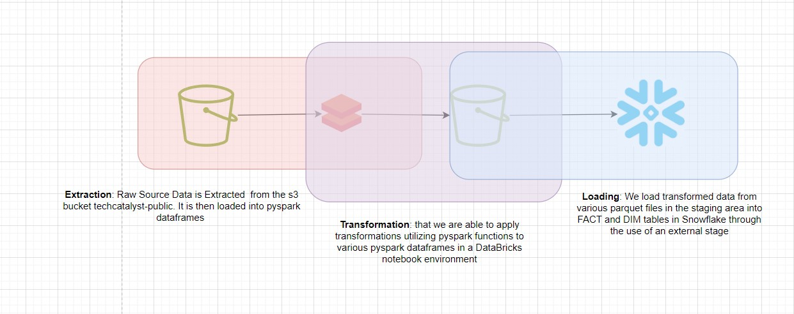
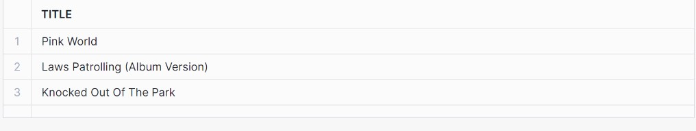

# Mini-ETL-Snowflake-Spark Project Write Up 
## DDL Statements That I Have Used To Create FACT and DIM TABLES In Snowflake:
```sql
create TRANSIENT TABLE TECHCATALYST_DE.SPATTURI.SONGS_DIM(
    song_id string, 
    title string,
    artist_id string,
    year integer,
    duration double
);

create TRANSIENT TABLE TECHCATALYST_DE.SPATTURI.ARTIST_DIM(
    artist_id string,
    artist_name string,
    artist_location string,
    artist_latitude double,
    artist_longitude double
);

create TRANSIENT TABLE TECHCATALYST_DE.SPATTURI.TIME_DIM (
    ts bigint,
    datetime string,
    start_time string,
    year integer,
    month integer,
    dayofmonth integer,
    weekofyear integer
);

create TRANSIENT TABLE TECHCATALYST_DE.SPATTURI.USER_DIM (
    userId string,
    firstName string,
    lastName string,
    gender string,
    level string
);

create TRANSIENT TABLE TECHCATALYST_DE.SPATTURI.SONGPLAYS_FACT (
    songplay_id integer,
    ts bigint,
    userId string,
    level string,
    song_id string,
    artist_id string,
    sessionId bigint,
    location string,
    userAgent string
);
```
## The Process That I Went About To Implement an End-to-End ETL Pipeline: 
I started off my loading the raw source data residing in the song_data and log_data folders of the techcatalyst-public AWS s3 bucket into pyspark dataframes that I have created. Whenever, I utilized pyspark, I got to work with it within a databricks notebook that I have created. Once I loadeded the raw source data from the json files into pyspark dataframes, I derived new dataframes and performed appropriate transformations using pyspark. Some transformations that I performed on the pyspark dataframes included casting columns to appropriate data types, partitioning, etc. I even performed feature engineering where columns in the pyspark dataframes containing transformed data were derived from other columns. At the end of the day, I had 5 pyspark dataframes containing transformed data - each dataframe contained data that would be loaded into a future snowflake DIM or FACT table and was written to a parquet file within the same s3 bucket but under a folder called dw_stage and this folder essentially represented the staging area. Once the parquet files containing transformed data were in the "staging area", data from each of these parquet files was loaded into a snowflake table that I had defined through the use of an external stage pointing to the staging area and a series of copy into commands. 

## Database Schema Design:
The Star Schema Design best describes the design for the tables in Snowflake that have been created for this specific ETL pipeline. In snowflake, one fact table and multiple dimension tables have been created. The SONGPLAYS_FACT table, the fact table for this pipeline, essentially contain attributes or columns that connect the dimension tables SONGS_DIM, ARTIST_DIM, TIME_DIM and USER_DIM rogether. The dimension tables on the other hand are meant to describe the records within the FACT table in more detail. 

## Discuss the purpose of the Data Lake, and Data Warehouse in context of the startup, Sparkify, and their analytical goals: 
The purpose of the data lake allowed us to obtain source data and place transformed data in a staging area before it was loaded into various tables within Snowflake. Through the use of Pyspark, we were able to take raw data from the data lake and made it available in a data warehouse for consumption by transforming and cleaning the data. Prior to loading data into the data warehouse(Snowflake database), we had to define the schema for each of the tables. The purpose of loading data into tables within Snowflake and not simply leaving it in an s3 is to allow data analysts at the company to easily work with the data. We want them to be able to make views, visualizations as well as anything else they may need to extract insights from the data and make the decisions in the best interests of Sparkify

# Design Diagram:

## An Example of A Query That I Ran to Extract Insights:
```sql
-- Give me the names of songs that were played in Waterloo-Cedar Falls, IA
SELECT TITLE
FROM TECHCATALYST_DE.SPATTURI.SONGS_DIM
JOIN TECHCATALYST_DE.SPATTURI.SONGPLAYS_FACT ON TECHCATALYST_DE.SPATTURI.SONGS_DIM.SONG_ID = TECHCATALYST_DE.SPATTURI.SONGPLAYS_FACT.SONG_ID
WHERE TECHCATALYST_DE.SPATTURI.SONGPLAYS_FACT.LOCATION = 'Waterloo-Cedar Falls, IA';
```
### Results of The Query: 

